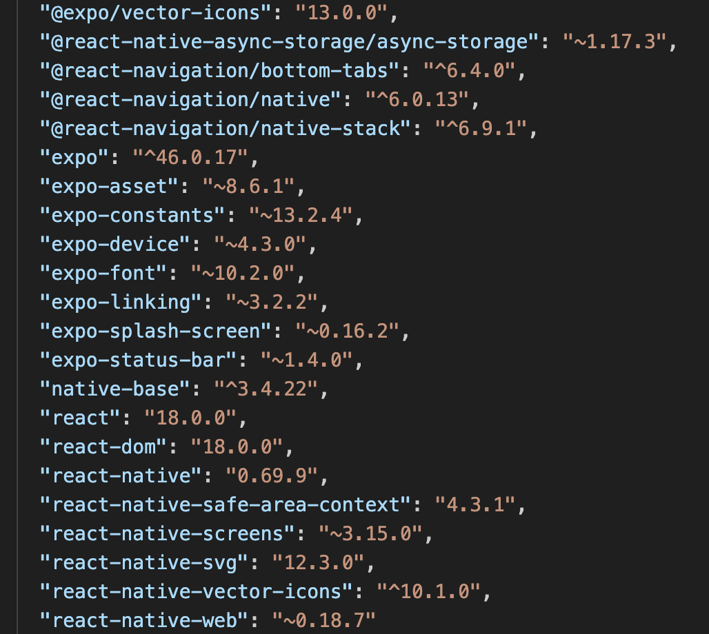

# Installation
In the project directory, you can run:
**npm install**

Installs all the node modules.

**npm run start**
Runs the app in the development mode.

# Tech stacks used
1. React Native
2. Expo
3. Native Base

# Packages used

# Best practices
1. Component based styling implemented.
2. Component and screens separated in folders.
3. Proper comments added in code.
4. Native base components are used.

# To do:
1. Make the web app pixel perfect as per design.
2. Implement click event on progress bar component.
3. Optimise the components.
4. Fix the font size, color of text in card component.
5. Implement icons as per design.
6. Convert all images in webp format to improve performance.
7. Install lint, prettier for error handling and formatting.
